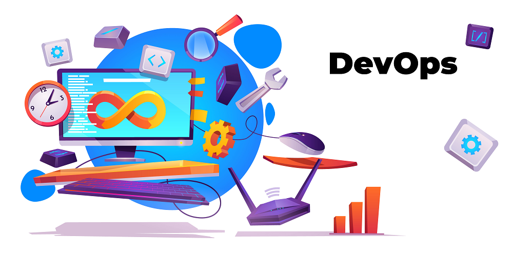

   

  

# Heber Augusto Scachetti

**Links:**
* [LinkedIn](https://www.linkedin.com/in/heberscachetti/)

## Projects:
* [GOlang docker example](https://github.com/heber-augusto/devops-golang-docker): * A docker-compose and docker files to create a golang environment using multistage to create a small image (less than 2MB size);
* [Laravel and other images docker example](https://github.com/heber-augusto/devops-laravel-docker): * A docker-compose file with Nginx, PHP-FPM, Redis, MySQL and laravel including dependencies checks and others important configurations;

---

